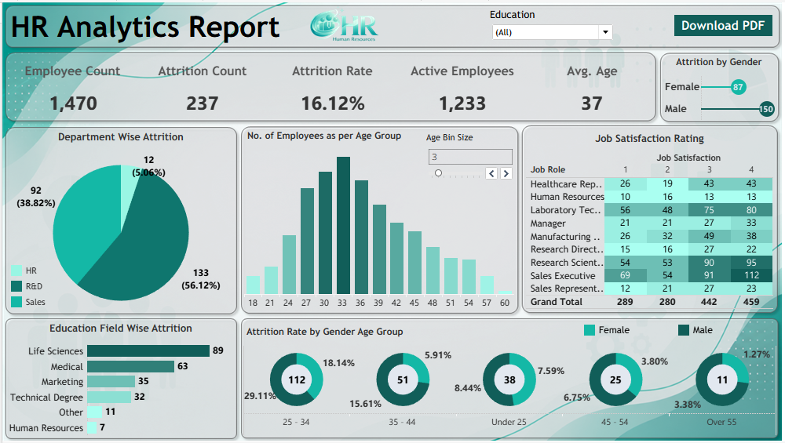

# **👥 HR Analytics Dashboard : Attrition \& Workforce Insights**

<details>
<summary><strong>DASHBOARD PREVIEW</strong></summary>
  


</details>


#### **Note:** *This is a guided course project completed as part of the Data Analytics Master Class by Satish Dhawale (SkillCourse). The dataset, business questions, and dashboard structure followed the course curriculum. This differs from my three independently designed projects (UPI Spending Analyzer, Agri-Supply Inventory Intelligence, and GreenYield India Supply Chain Audit), where defined the problem, built the database, and made my own analytical decisions throughout. This project was built to strengthen my Tableau skills specifically and round out my domain coverage into HR/People Analytics.*

---
## 📌 Project Overview
An HR Analytics dashboard analyzing workforce data across 1,470 employees - examining attrition patterns by department, age group, gender, education background, and job satisfaction to identify where the organization is losing people and why.

---

## 🎯 Business Questions Addressed
1. What is the overall status of the workforce?
2. Which department has the highest attrition?
3. Which age group has the highest number of employees?
4. Which age group has the highest attrition?
5. What does gender-wise attrition indicate?
6. Which education background has the highest attrition?
7. How satisfied are employees across different job roles?
8. What is the employee distribution across gender and age groups?
9. Is the attrition rate alarming?
10. Which segments contribute the most to overall attrition?

---

## 🛠️ Tech Stack


> Built an interactive HR dashboard with dynamic filtering, age-bin controls, and drill-down visuals across department, education, and gender dimensions.


---

## 📊 Dashboard

<details>
<summary><strong>DASHBOARD PREVIEW</strong></summary>


</details>

**Visuals included:**
- Department-wise Attrition (Pie Chart)
- Number of Employees by Age Group (Adjustable bin size)
- Job Satisfaction Rating by Job Role (Table visual with color grading)
- Education Field-wise Attrition (Horizotal Bar)
- Attrition Rate by Gender and Age Group (Donut cluster)

---

## 🔑 Key Insights

1. **Total workforce:** 1,470 employees, 237 attritions — an overall attrition rate of **16.12%**.
2. **Sales dominates attrition:** The Sales department accounts for **56.12%** of all attrition (133 of 237 cases) more than Research & Development (38.82%) and HR (5.06%) combined.
3. **25-34 age group is the highest-risk segment:** This bracket has both the largest employee population and the highest attrition volume 112 total attritions, split as 29.11% of females and 18.14% of males *within that age group specifically*.
4. **Gender attrition needs a rate lens, not just a count lens:** While male attrition count is higher overall (150 vs. 87), the *rate* within the 25-34 bracket is actually higher for females (29.11%) than males (18.14%) a distinction that matters more  than the raw totals suggest.
5. **Life Sciences and Medical backgrounds show the highest education-linked attrition** 89 and 63 cases respectively, together accounting for the majority of education-field attrition.
6. **Job satisfaction is unevenly distributed:** Sales Executive and Research Scientist roles show the largest total response volumes, worth cross-referencing against their attrition numbers for a fuller picture.


---


## 💡 Recommendation
Attrition is concentrated in the Sales department and the 25-34 age group. Since attrition *rate* (not just count) skews higher for females in that same age bracket, workforce retention efforts should examine role clarity, career growth paths, and workload specifically within Sales with attention to how these factors affect different gender and age segments differently, rather than applying a single blanket retention strategy.


---

## 📁 Project Structure

```text
hr-analytics-dashboard/
│
├──📁data/
│ └── hr_data.csv
│
├── 📊dashboard/
│ └── hr_analytics_dashboard.twbx
│
├── 🖼️visuals/
│ └── hr_analytics_dashboard.png
│
└──📄README.md
```


---

## 👤 Author

### **ASIF KHAN**  
#### ***Data Analyst | Python | SQL | Power BI | Statistics | Tableau | Excel***

* 🔗 **[LinkedIn]** - ***https://www.linkedin.com/in/asif-khan-data-analyst/*** 

* 📧 **[Gmail]** - ***akhan749943@gmail.com***

